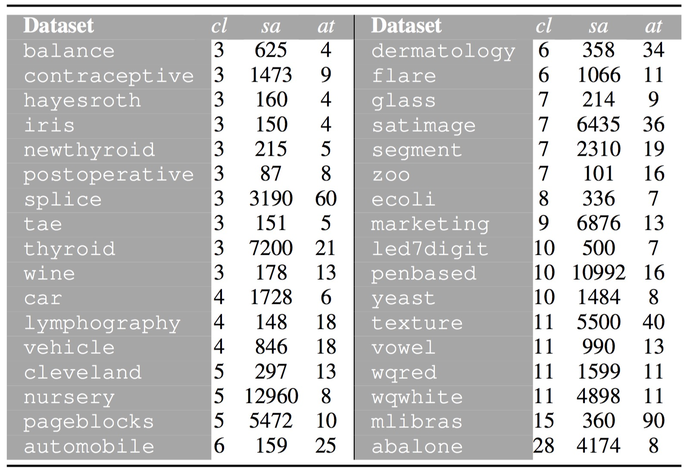

 

This web-page contains complementary material to the research paper:

| | |
|:---|:---|
||José A. Sáez, Mikel Galar, Bartosz Krawczyk. **Addressing the overlapping data problem in classification using the One-vs-One decomposition strategy**. [IEEE Access](https://ieeeaccess.ieee.org/), vol. 7, pp. 83396 - 83411, 2019.|
| | |

 

The web is organized according to the following summary:

1. [Abstract](#Abstract)
2. [Real-world datasets](#Datasets)
3. [Performance results](#Performance)

 
 
##  1. Abstract
Learning good-performing classifiers from data with easily separable classes is not usually a difficult task for most of algorithms. However, problems affecting classifier performance may arise when samples from different classes share similar characteristics or are *overlapped*, since the boundaries of each class may not be clearly defined. In order to address this problem, the majority of existing works in the literature propose to either adapt well-known algorithms to reduce the negative impact of overlapping or modify the original data by introducing/removing features which decrease the overlapping region. However, these approaches may present some drawbacks: the changes in specific algorithms may not be useful for other methods and modifying the original data can produce variable results depending on data characteristics and the technique used later. An unexplored and interesting research line to deal with the overlapping phenomenon consists of decomposing the problem into several binary subproblems to reduce its complexity, diminishing the negative effects of overlapping. Based on this novel idea in the field of overlapping data, this research proposes the usage of the *One-vs-One* (OVO) strategy to alleviate the presence of overlapping, without modifying existing algorithms or data conformations as suggested by previous works. To test the suitability of the OVO approach with overlapping data, and due to the lack of proposals in the specialized literature, this research also introduces a novel scheme to artificially induce overlapping in real-world datasets, which enables us to simulate different types and levels of overlapping among the classes. The results obtained show that the methods using OVO achieve better performances when considering data with overlapped classes than those dealing with all classes at the same time.

 
 
##  2. Real-world datasets
The experimentation considers 34 real-world datasets, in which overlapping is introduced. The following table shows these datasets sorted by their number of classes (*cl*), along with the number of samples (*sa*) and attributes (*at*). Examples containing missing values are removed from the datasets before their usage.

These datasets can be downloaded from the web-page of the [UCI Machine Learning Repository](https://archive.ics.uci.edu/ml/index.php).

 

##  3. Performance results

|||
|:---|:---:|
|**Results of overlapping data affecting training and test sets** |**File**|
|&nbsp;&nbsp;&nbsp;**-** *Accuracy on all the types of samples* | |
|&nbsp;&nbsp;&nbsp;**-** *Accuracy in non-overlapping regions* | |
|&nbsp;&nbsp;&nbsp;**-** *Accuracy in overlapping regions* | |
|&nbsp;&nbsp;&nbsp;**-** *Robustness of the classifiers* | |
|||
|**Results of overlapping data only affecting training sets** |**File**|
|&nbsp;&nbsp;&nbsp;**-** *Accuracy on all the types of samples* | |
|&nbsp;&nbsp;&nbsp;**-** *Robustness of the classifiers* | |
|||
